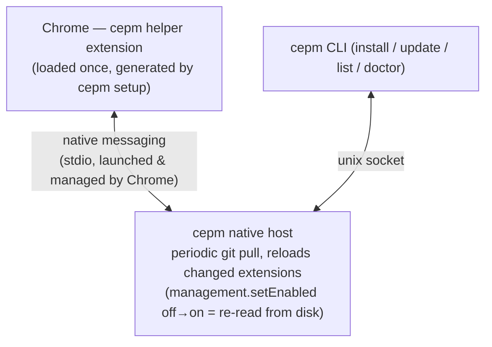
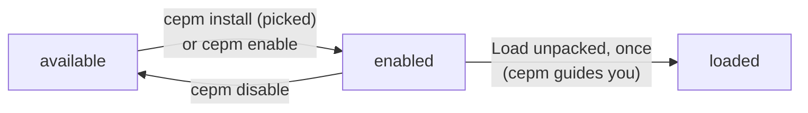

# cepm

**C**hrome **E**xtension **P**ackage **M**anager — keep git-distributed, unpacked
Chrome extensions up to date automatically.

*日本語版: [docs/README.ja.md](docs/README.ja.md)*

Internal Chrome extensions (where the Web Store is not an option) are
usually distributed as git repos: everyone clones, loads via
*chrome://extensions* → "Load unpacked", and from then on must remember to
`git pull` **and** hit reload for every extension. cepm automates both:

```console
$ cepm install git@github.example.com:team/internal-extensions.git
```

After a one-time "Load unpacked" per extension, cepm pulls every hour while
Chrome runs (plus once shortly after Chrome starts) and reloads the
extensions whose files changed. `cepm update` does the same on demand.

## Getting started

**1. Install cepm.**

```console
$ brew install --cask be-hase/tap/cepm                 # macOS
$ # or: go install github.com/be-hase/cepm/cmd/cepm@latest, or grab a release binary
```

**2. Connect it to Chrome** (once per machine):

```console
$ cepm setup
$ # chrome://extensions → Developer mode → "Load unpacked" → ~/.cepm/helper
$ cepm doctor
```

`setup` generates the helper into `~/.cepm/helper` and registers the native
messaging host; loading the helper is the one step Chrome insists a human
performs. Every `doctor` check should show ✔ — except "Chrome is not
reachable", which is normal while Chrome is closed.

**3. Install an extension repository:**

```console
$ cepm install git@github.example.com:team/internal-extensions.git
```

cepm asks which extensions you want, then walks you through loading each
one: path on your clipboard, chrome://extensions opened, load confirmed.

That's it — from here on, updates are automatic.

macOS and Linux are supported (Windows contributions welcome).

## Everyday use

### Staying up to date

While Chrome runs, cepm pulls every hour (and once shortly after Chrome
starts) and reloads the extensions whose files changed, so day to day
there is nothing to do. To update right now:

```console
$ cepm update                     # pull everything, reload what changed
$ cepm update --no-reload         # pull only
```

Two caveats:

- A `manifest.json` change (version bump, new permission) only applies
  after a Chrome restart — cepm says so when it happens.
- With Chrome closed, `cepm update` still pulls; the changes are applied
  shortly after the next Chrome start.

### Seeing what you have

```console
$ cepm list
```

The default is one row per repo, showing only what is loaded plus a count
of what it hides. `--all` shows every status, one row per extension;
`--full` shows all columns (EXTENSION, ID, DIR and URL);
`--status not-loaded,stale` filters by status; `--json` is for scripts.

### Choosing extensions within a repo

One repository can contain any number of extensions (any directory with a
`manifest.json`). `cepm install` asks which ones you want (Enter = all;
`--only dir,dir` / `--all` for scripts); the rest stay registered as
*available* — nothing gets loaded or nagged about without opting in.
Extensions the repo adds later wait there too. Change your mind anytime:

```console
$ cepm enable <repo>[/<dir>]      # start using one (cepm guides the one-time load)
$ cepm disable <repo>[/<dir>]     # stop using one (kept as "available")
```

When the repo renames or deletes an extension directory, cepm reports it,
carries your enabled choice to the new path, and `cepm cleanup` removes
the orphaned Chrome entry.

### Following releases instead of a branch

If a repo's default branch carries unstable work-in-progress, follow
version tags — cepm then only ever checks out the highest released version:

```console
$ cepm install <git-url> --track tag                  # newest stable version
$ cepm install <git-url> --track tag --prerelease     # ...including v2.0.0-rc1
$ cepm install <git-url> --track tag --tag-pattern "v1.*"     # stay on 1.x
```

Tags are compared as semver (`v1.10.0` beats `v1.9.0`). Prereleases are
skipped without `--prerelease`, non-version tags (a stray `nightly`) are
ignored, and if no version tag matches cepm reports it rather than guessing.

cepm follows tags, not the GitHub Releases API — no tokens, and no access to
`api.github.com` needed. Two consequences: a tag pushed without a release is
followed like any other (tag only what you ship), and the *prerelease*
checkbox is invisible to cepm — name prereleases `v2.0.0-rc1`, not `v2.0.0`.

An installed repo can switch modes anytime, without reinstalling — the clone,
extension IDs, and enable/disable choices are all kept:

```console
$ cepm track <name> tag                       # branch → latest release tag
$ cepm track <name> tag --tag-pattern "v1.*"  # ...or change the pattern later
$ cepm track <name> branch                    # back to the branch
```

### Sharing your setup with a colleague

```console
$ cepm list --share
```

prints the `cepm install` commands for your enabled extensions, ready to
paste into a chat.

### Hacking on an extension locally

Edit the clone under `~/.cepm/repos/<name>` directly, then:

```console
$ cepm reload                     # reload without pulling
```

A repo with local modifications is skipped by updates (with a warning) so
your experiments are never clobbered; `cepm update --force` stashes and
restores them around the pull.

### Removing things

```console
$ cepm disable <repo>[/<dir>]     # stop using one extension (kept as "available")
$ cepm uninstall <name>           # unregister the repo
$ cepm cleanup                    # remove broken Chrome entries after upstream renames/deletes
```

cepm never deletes your data: `uninstall` *moves* the clone to a trash
directory (`--keep-files` leaves it in place), and removals from Chrome
always go through Chrome's own confirmation dialog.

### When something looks wrong

```console
$ cepm doctor
```

It checks the whole chain, and every failure it reports comes with the
command that fixes it. See [Troubleshooting](#troubleshooting) for the
common cases.

## Command reference

```console
$ cepm install <git-url>          # clone + register (then load unpacked once)
$ cepm update                     # pull everything, reload what changed
$ cepm track <name> tag           # switch to tag tracking (or back: ... branch)
$ cepm list                       # what's loaded (--all: everything registered)
$ cepm enable <repo>[/<dir>]      # start using an extension of a repo
$ cepm disable <repo>[/<dir>]     # stop using one (kept as "available")
$ cepm reload                     # reload without pulling (local hacking)
$ cepm cleanup                    # remove broken Chrome entries after renames/deletes
$ cepm uninstall <name>           # unregister; the clone moves to a trash dir
$ cepm doctor                     # diagnose setup / connectivity
$ cepm reset                      # unusable state? move it + clones to a backup, start over
$ cepm id <path>                  # print the extension ID for a directory
```

`cepm list --json` and `cepm doctor --json` emit machine-readable output;
`-v` works on any command.

## Configuration (`~/.cepm/config.toml`, optional)

```toml
[update]
interval = "1h"    # auto-update cadence while Chrome runs (min "1m")
auto     = true    # set false to only update via "cepm update"

[git]
stash_dirty = false  # stash local edits around pulls (also the periodic ones)
```

cepm never deletes a stash entry — it reports the one it left, and you
remove it when convenient (`git -C <clone> stash list`). With
`git.stash_dirty = true` a clone left dirty collects one entry per
automatic update; each is logged to `~/.cepm/logs/host.log`.

## For extension authors (`cepm.toml`, optional)

Commit a `cepm.toml` at the repo root so that consumers get the right
behavior with a plain `cepm install <url>`:

```toml
# Explicit extension directories (skips auto-detection):
extensions = ["dist/sidebar", "dist/search"]

# Recommend release tracking to consumers:
track = "tag"
tag_pattern = "v*"
# prerelease = true   # opt consumers into release candidates as well
```

Renaming an extension directory is a breaking change — Chrome derives
extension IDs from paths, so every user must re-load the new directory
once (cepm guides them). Keep directory names stable, or pin the ID with a
`key` in manifest.json, which survives moves.

## How it works



- No daemons to configure: Chrome itself starts and stops the native host.
- With Chrome closed, `cepm update` still pulls; the next Chrome start runs
  a catch-up reload (Chrome caches code — service workers in particular —
  until told to re-read the disk).
- cepm upgrades propagate hands-free: Chrome launches the host via a stable
  launcher script (`~/.cepm/bin/cepm-host`) that every cepm run keeps
  pointed at the current binary, and the helper's files are refreshed on
  connect (effective at the next Chrome start).

### The life of an extension



- **available** — registered, nothing more. Extensions you skipped at
  install, and ones the repo adds later, wait here until you opt in.
- **enabled** — you want it: cepm updates it and expects it in Chrome. Only
  the one-time load is missing.
- **loaded** — hands-free from here on. One exception: a `manifest.json`
  change only applies after a Chrome restart (cepm tells you).

The road back: `cepm disable` returns an extension to *available* (and
offers to remove it from Chrome), `cepm uninstall <repo>` unregisters the
repo and moves its clone to a trash directory, and `cepm cleanup` clears
Chrome entries orphaned by upstream renames or deletes.

## Troubleshooting

**Start with `cepm doctor`.** It checks the whole chain, and every failure
it reports comes with the command that fixes it. The short versions:

- **An extension is not picking up changes** although `cepm update` says it
  reloaded — the change was in `manifest.json`; restart Chrome.
- **"Chrome is not reachable"** — expected while Chrome is closed; pulls
  still work. If Chrome *is* running, check that the helper is loaded and
  enabled in chrome://extensions.
- **An extension is gone from Chrome, or shows an error there** — the repo
  renamed or deleted its directory. `cepm cleanup` removes the dangling
  entry; for renames cepm names the directory to load instead.
- **"cepm cannot use this state file"** — `~/.cepm/state.json` was changed
  outside cepm or a write was interrupted; cepm stops rather than guess.
  `cepm reset` moves state + clones into a timestamped backup (deletes
  nothing); then re-run `cepm install` (old URLs: the backup's
  `state.json`, or `git -C <backup>/repos/<name> remote get-url origin`).
- **"exists but no repository is registered for it"** — an install was
  killed half-way. Remove that directory and install again.
- **Nothing auto-updates** — auto-update runs inside the host, which only
  lives while Chrome runs. Check `[update] auto` in `~/.cepm/config.toml`,
  remember the interval defaults to one hour, and read
  `~/.cepm/logs/host.log`.

## Notes & limitations

- The first load of an extension is always manual — Chrome has no "load
  unpacked" API. cepm prints the exact directories, only for new ones.
- **manifest.json changes need a Chrome restart.** A reload re-reads code,
  not the cached manifest: code updates are live immediately; a version
  bump, new permission, or newly declared file waits for a restart. cepm
  says so when it happens, and doctor keeps flagging it until applied.
- Updates pulled while Chrome was closed are applied by reloading every
  enabled extension once, right after Chrome connects.
- A cepm upgrade rewrites the helper's files, but the running helper keeps
  its version until the next Chrome start.
- **Load the helper into one Chrome profile only** — reloads reach the
  profile whose helper connected first. Across Chrome *variants*
  (Stable/Beta/Canary/Chromium), `cepm setup --chrome-variant <x>` moves
  the registration for you (then quit the previous Chrome — setup warns);
  within one Chrome, keeping the helper out of second profiles is your job.
- The helper needs `management` (to toggle other extensions),
  `nativeMessaging`, `alarms`, and `storage` (a crash-recovery marker for
  its own reloads). It never touches page data.
- Everything lives under `~/.cepm/` (clones, state, logs at
  `~/.cepm/logs/host.log`), owner-only.
- cepm never deletes your data: `uninstall` *moves* the clone to a trash
  directory (`--keep-files` leaves it in place), `reset` only moves things
  into a backup, and removals from Chrome always go through Chrome's own
  confirmation dialog.

## Development

```console
$ make build   # bin/cepm
$ make test    # unit + integration tests
$ make e2e     # drives a real Chrome (downloads Chrome for Testing once)
$ make lint    # gofmt check + go vet + staticcheck (both build tags)
```

`make e2e` launches Chrome with a throwaway profile, installs the helper
and a test extension, and asserts that a `git push` actually changes the
code Chrome is running — including auto-update, updates applied while
Chrome was closed, and the helper refresh. `CEPM_E2E_HEADED=1` to watch it.
`docs/e2e-checklist.md` lists what a human still has to check.

## License

MIT
