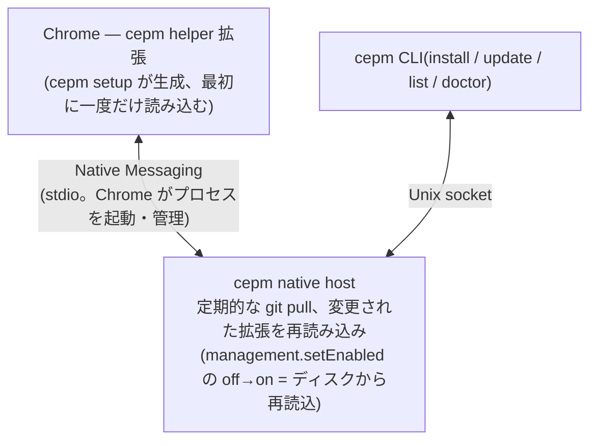
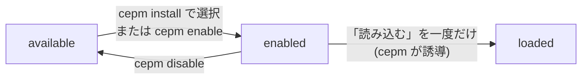

# cepm(日本語版)

**C**hrome **E**xtension **P**ackage **M**anager — git で配布している unpacked
な Chrome 拡張を、自動で最新に保つツールです。

> この文書は [README.md](../README.md) の日本語版です。内容が食い違っていた
> 場合は英語版が正となります。

社内向けの Chrome 拡張(Web Store が使えないもの)は git リポジトリで配布
されることが多く、利用者は clone して *chrome://extensions* の「パッケージ化
されていない拡張機能を読み込む」で読み込みます。面倒なのはその後で、更新の
たびに `git pull` **と**拡張ごとの再読み込みが必要です。cepm はこの両方を
自動化します。

```console
$ cepm install git@github.example.com:team/internal-extensions.git
```

拡張ごとに一度だけ「読み込む」を行えば、あとは自動です。Chrome の起動中は
1 時間ごと(および起動直後にも一度)に pull し、ファイルが変わった拡張だけを
再読み込みします。任意のタイミングで実行したいときは `cepm update` です。

## はじめかた

**1. cepm をインストールします。**

```console
$ brew install --cask be-hase/tap/cepm                 # macOS
$ # または: go install github.com/be-hase/cepm/cmd/cepm@latest、リリースバイナリの取得でも可
```

**2. Chrome と接続します**(マシンごとに一度だけ):

```console
$ cepm setup
$ # chrome://extensions → デベロッパーモード →
$ #   「パッケージ化されていない拡張機能を読み込む」→ ~/.cepm/helper
$ cepm doctor
```

`setup` は helper 拡張を `~/.cepm/helper` に生成し、Native Messaging host を
Chrome に登録します。helper の読み込みだけは Chrome の仕様上、手動です。
`doctor` はすべて緑になるはずです(Chrome 終了中の「Chrome is not
reachable」だけは正常です)。

**3. 拡張のリポジトリをインストールします:**

```console
$ cepm install git@github.example.com:team/internal-extensions.git
```

どの拡張を使うか尋ねたあと、読み込み操作まで誘導します。パスがクリップ
ボードに入り、chrome://extensions が開き、読み込みを cepm が確認します。

セットアップは以上です。以降の更新は自動で行われます。

対応 OS は macOS と Linux です(Windows は contributions welcome)。

## 普段の使い方

### 最新に保つ

Chrome の起動中は 1 時間ごと(および起動直後にも一度)に pull し、ファイル
が変わった拡張だけを再読み込みするので、普段やることはありません。今すぐ
更新したいときは:

```console
$ cepm update                     # すべて pull し、変更された拡張を再読み込み
$ cepm update --no-reload         # pull のみ
```

注意点は 2 つ:

- `manifest.json` の変更(バージョン上げ、権限の追加)だけは Chrome の
  再起動後に反映されます(該当したときは cepm が伝えます)。
- Chrome の終了中でも `cepm update` は pull できます。変更は次の Chrome
  起動直後に反映されます。

### 一覧を見る

```console
$ cepm list
```

デフォルトはリポジトリごとに1行で、読み込み済みのみを表示し、隠した件数を
末尾に出します。`--all` は全ステータスを拡張ごとの行で表示、`--full` は
EXTENSION・ID・DIR・URL の全列を表示、`--status not-loaded,stale` は
ステータスでの絞り込み、`--json` はスクリプト用です。

### 使う拡張を選ぶ

1 つのリポジトリに拡張がいくつ入っていても構いません(`manifest.json` の
あるディレクトリを自動検出)。`cepm install` はどれを使うか尋ねます
(Enter で全部。スクリプトからは `--only dir,dir` や `--all`)。選ばなかった
ものは「利用可能(available)」として登録されるだけで、オプトインなしに
読み込まれたり催促されたりはしません。あとからリポジトリに追加された拡張も
同様です。選択はあとから変えられます:

```console
$ cepm enable <repo>[/<dir>]      # 使い始める(一度だけの読み込みは cepm が誘導)
$ cepm disable <repo>[/<dir>]     # 使うのをやめる(「利用可能」として残る)
```

リポジトリ側で拡張のディレクトリが改名・削除されたときは cepm が報告し、
有効の選択は新しいパスへ引き継がれ、壊れた Chrome 側のエントリは
`cepm cleanup` が削除します。

### ブランチではなくバージョンタグを追う

デフォルトブランチに開発中のコードが入る場合はタグ追従にできます。cepm は
常に最新のリリースバージョンだけを checkout します。

```console
$ cepm install <git-url> --track tag                  # 最新の安定版
$ cepm install <git-url> --track tag --prerelease     # v2.0.0-rc1 なども含める
$ cepm install <git-url> --track tag --tag-pattern "v1.*"   # 1.x 系に留まる
```

比較は semver です(`v1.10.0` は `v1.9.0` より新しい)。プレリリースは
`--prerelease` なしでは無視され、バージョン番号でないタグ(`nightly` など)
も無視されます。一致するタグがなければ、推測せずエラーとして報告します。

cepm が見るのは GitHub Releases API ではなくタグです(トークン不要、
`api.github.com` に届かない環境でも動きます)。帰結は 2 つ: リリースを
作らずに push したタグも追われる(配布するものにだけタグを打つ)、
「プレリリース」チェックボックスは見えない(`v2.0.0` ではなく
`v2.0.0-rc1` と命名する)。

インストール済みのリポジトリは、再インストールなしでいつでもモードを
切り替えられます。clone・拡張 ID・有効/無効の選択はすべて維持されます:

```console
$ cepm track <name> tag                       # ブランチ → 最新リリースタグ
$ cepm track <name> tag --tag-pattern "v1.*"  # あとからパターンだけ変更も可
$ cepm track <name> branch                    # ブランチ追従に戻す
```

### 同僚に共有する

```console
$ cepm list --share
```

有効化中の拡張の `cepm install` コマンドを、そのままチャットに貼れる形で
出力します。

### 拡張をローカルで開発する

`~/.cepm/repos/<name>` の clone を直接編集して:

```console
$ cepm reload                     # pull せず再読み込みだけ
```

ローカルに変更のあるリポジトリは警告つきで更新から skip され、作業中の
内容が失われることはありません。`cepm update --force` は pull の前後で
stash と復元を行います。

### 使うのをやめる

```console
$ cepm disable <repo>[/<dir>]     # 拡張を使うのをやめる(「利用可能」として残る)
$ cepm uninstall <name>           # リポジトリごと登録解除
$ cepm cleanup                    # 改名・削除で壊れた Chrome 側のエントリを削除
```

cepm はユーザーのデータを削除しません。`uninstall` は clone をゴミ箱
ディレクトリへ**移動**し(`--keep-files` でその場に残す)、Chrome からの
削除は必ず Chrome 自身の確認ダイアログを通します。

### うまく動かないときは

```console
$ cepm doctor
```

セットアップから接続までの一連の流れを確認し、失敗には必ず対処コマンドが
添えられます。よくあるケースは[困ったときは](#困ったときは)にまとめて
あります。

## コマンド一覧

```console
$ cepm install <git-url>          # clone して登録(このあと一度だけ読み込む)
$ cepm update                     # すべて pull し、変更された拡張を再読み込み
$ cepm track <name> tag           # タグ追従に切り替え(branch で元に戻す)
$ cepm list                       # 読み込み済みの拡張(--all で登録内容すべて)
$ cepm enable <repo>[/<dir>]      # リポジトリ内の拡張を使い始める
$ cepm disable <repo>[/<dir>]     # 使うのをやめる(登録は「利用可能」として残る)
$ cepm reload                     # pull せず再読み込みだけ(ローカルでの開発用)
$ cepm cleanup                    # 改名・削除で壊れた Chrome 側のエントリを削除
$ cepm uninstall <name>           # 登録解除。clone はゴミ箱ディレクトリへ移動
$ cepm doctor                     # セットアップと接続状況の診断
$ cepm reset                      # state が壊れたとき、state と clone を退避してやり直す
$ cepm id <path>                  # ディレクトリに対応する拡張 ID を表示
```

`cepm list --json` と `cepm doctor --json` は機械可読の出力、`-v` は
任意のコマンドで使えます。

## 利用者側の設定(`~/.cepm/config.toml`、任意)

```toml
[update]
interval = "1h"    # Chrome 起動中の自動更新の間隔(最小 "1m")
auto     = true    # false にすると "cepm update" 実行時のみ更新

[git]
stash_dirty = false  # ローカル変更を stash して pull(自動更新にも適用)
```

cepm が stash エントリを削除することはなく、残したエントリは報告される
ので都合のよいときに削除してください(`git -C <clone> stash list`)。
`git.stash_dirty = true` の場合、変更を残したままの clone には自動更新ごとに
1 件ずつ溜まります(`~/.cepm/logs/host.log` に記録されます)。

## 拡張の作者向け(`cepm.toml`、任意)

リポジトリのルートに `cepm.toml` を置くと、利用者が単に
`cepm install <url>` するだけで適切な設定になります。

```toml
# 拡張ディレクトリの明示(自動検出をやめる):
extensions = ["dist/sidebar", "dist/search"]

# 利用者にタグ追従を推奨する:
track = "tag"
tag_pattern = "v*"
# prerelease = true   # 利用者にリリース候補も配る場合
```

拡張ディレクトリの改名は破壊的変更です。Chrome は ID をパスから導出する
ため、利用者全員が一度読み込み直すことになります(cepm が案内します)。
ディレクトリ名は安定させるか、`manifest.json` の `key` で ID を固定して
ください(移動しても ID が変わりません)。

## 仕組み



- 常駐デーモンの設定は不要です。native host は Chrome が起動・終了させます。
- Chrome が起動していなくても `cepm update` は pull できます。Chrome は
  キャッシュしたコード(特に service worker)を使い続けるため、次の Chrome
  起動時に catch-up reload で反映されます。
- cepm 自身の更新も自動で反映されます。Chrome は安定したパスの launcher
  スクリプト(`~/.cepm/bin/cepm-host`)経由で host を起動し、helper 拡張の
  ファイルも接続時に更新されます(次回の Chrome 起動から有効)。

### 拡張のライフサイクル



- **available(利用可能)** — 登録されているだけの状態。install で選ばな
  かった拡張や、あとからリポジトリに追加された拡張は、オプトインするまで
  ここで待ちます。
- **enabled(有効)** — 使うと決めた状態。cepm が更新を適用し、Chrome に
  あることを期待します。残るは一度だけの手動読み込みです。
- **loaded(読み込み済み)** — 以降は全自動です。唯一の例外は
  `manifest.json` の変更で、Chrome の再起動後に反映されます(cepm が知らせ
  ます)。

戻り道: `cepm disable` は *available* に戻し(Chrome からの削除も提案)、
`cepm uninstall <repo>` はリポジトリごと登録解除して clone をゴミ箱ディレク
トリへ移動、リポジトリ側の改名・削除で残った Chrome のエントリは
`cepm cleanup` が削除します。

## 困ったときは

**まず `cepm doctor` を実行してください。** 一連の流れをすべて確認し、失敗
には必ず対処コマンドが添えられます。要点だけまとめると:

- **拡張に変更が反映されない**(update は再読み込みしたと言っている)—
  変更箇所は `manifest.json` です。Chrome を再起動してください。
- **「Chrome is not reachable」** — Chrome 終了中は正常です(pull は動き
  ます)。起動中に出る場合は、chrome://extensions で helper が読み込まれ
  有効になっているかを確認してください。
- **Chrome から拡張が消えた・エラー表示になっている** — リポジトリ側の
  改名・削除が原因です。`cepm cleanup` が宙に浮いたエントリを削除し、改名
  なら代わりに読み込むディレクトリを案内します。
- **「cepm cannot use this state file」** — `~/.cepm/state.json` が外部に
  書き換えられたか、書き込みが中断されました。cepm は推測せず停止します。
  `cepm reset` が state と clone をタイムスタンプ付きバックアップへ移動する
  ので(削除はしません)、`cepm install` し直してください。元の URL は
  バックアップの `state.json` か
  `git -C <backup>/repos/<name> remote get-url origin` で確認できます。
- **「exists but no repository is registered for it」** — install が途中で
  中断された状態です。そのディレクトリを削除して install し直してください。
- **自動更新されない** — 自動更新は host の中で動き、host は Chrome の起動
  中しか存在しません。`~/.cepm/config.toml` の `[update] auto` と、間隔の
  既定が 1 時間であることを確認し、`~/.cepm/logs/host.log` を見てください。

## 注意事項・制限

- 拡張の最初の読み込みだけは必ず手動です(Chrome に「unpacked を読み込む」
  API がないため)。cepm は新規の拡張についてのみ、読み込むディレクトリを
  表示します。
- **`manifest.json` の変更には Chrome の再起動が必要です。** 再読み込みで
  読み直されるのはコードだけで、manifest はキャッシュが使われ続けます。
  該当したときは cepm が伝え、反映まで doctor が指摘し続けます。
- Chrome の終了中に pull された更新は、次に Chrome が接続した直後、有効な
  拡張をすべて一度再読み込みすることで反映されます。
- cepm を更新すると helper のファイルも書き換わりますが、動作中の helper は
  次の Chrome 起動まで現在のバージョンのままです。
- **helper を読み込むのは 1 つの Chrome プロファイルだけにしてください。**
  自動再読み込みは最初に接続した helper のプロファイルに届きます。Chrome の
  **種別**(Stable/Beta/Canary/Chromium)は `cepm setup --chrome-variant <x>`
  が登録を移してくれます(あとは以前の Chrome を終了するだけ。setup が警告
  します)。同一 Chrome 内で 2 つ目のプロファイルに入れないのは利用者側の
  責任です。
- helper 拡張に必要な権限は `management`(他の拡張の切り替え)、
  `nativeMessaging`、`alarms`、`storage`(reload 中のクラッシュ復旧マーカー)
  です。ページのデータには一切触れません。
- すべて `~/.cepm/` 配下(clone、state、ログは `~/.cepm/logs/host.log`)、
  パーミッションは所有者のみです。
- cepm はユーザーのデータを削除しません。`uninstall` は clone をゴミ箱
  ディレクトリへ**移動**(`--keep-files` でその場に残す)、`reset` も移動
  のみ、Chrome からの削除は必ず Chrome 自身の確認ダイアログを通します。

## 開発

```console
$ make build   # bin/cepm
$ make test    # ユニットテストと結合テスト
$ make e2e     # 実際の Chrome を操作(初回は Chrome for Testing を取得)
$ make lint    # gofmt check + go vet + staticcheck (both build tags)
```

`make e2e` は使い捨てプロファイルで Chrome を起動し、helper とテスト用拡張を
読み込み、`git push` が Chrome の実行コードを実際に変えることを検証します
(自動更新、Chrome 停止中の更新、helper の更新も含む)。
`CEPM_E2E_HEADED=1` で目視できます。人間が確認する項目は
`docs/e2e-checklist.md` に、設計上の不変条件は [AGENTS.md](../AGENTS.md) に
あります。

## ライセンス

MIT
